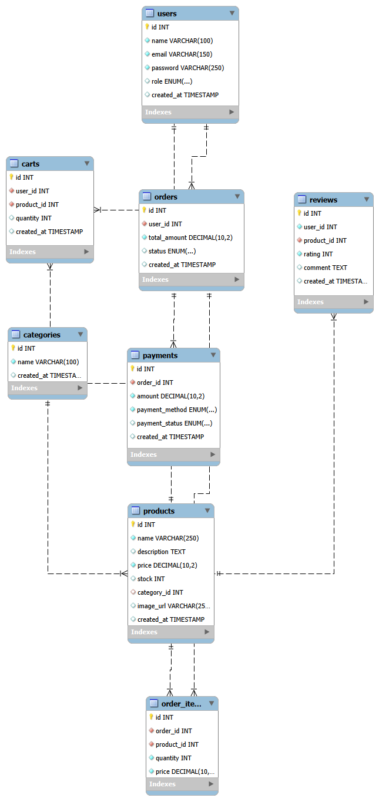

# 🛒 Ecommerce Backend API

A RESTful Ecommerce Backend API built with **Node.js**, **Express.js**, **MySQL**, and **JWT Authentication**.

---

# 📌 Project Overview

This project is a complete backend for an ecommerce application. It provides secure authentication, product management, shopping cart functionality, order processing with MySQL transactions, reviews, and category management using RESTful APIs.

The project follows the MVC architecture with a dedicated service layer, middleware, and validation to keep the code clean and maintainable.

---

# 🛠 Tech Stack

- Node.js
- Express.js
- MySQL
- JWT
- bcrypt
- Joi
- MySQL2
- Dotenv

---

# ✨ Features

## Authentication

- User Registration
- User Login
- JWT Authentication
- Password Hashing
- Role-Based Authorization

## Products

- Create Product
- Update Product
- Delete Product
- Get Product
- Pagination
- Search
- Sorting
- Category Filter

## Categories

- Create Category
- Get Products by Category

## Cart

- Add to Cart
- Remove Item
- Clear Cart
- View Cart

## Orders

- Create Order
- Order Details
- Update Order Status
- Transaction-based Checkout
- Automatic Stock Reduction

## Reviews

- Add Review
- Get Reviews by Product

---

# 📂 Folder Structure

```text
controllers/
middleware/
routes/
services/
validators/

app.js
server.js
db.js
```

---

# 🗄 Database Schema



---

# 📡 API Endpoints

## Authentication

POST `/auth/register`

POST `/auth/login`

## Products

GET `/products`

POST `/products`

PATCH `/products/:id`

DELETE `/products/:id`

## Categories

POST `/categories`

## Cart

POST `/api/cart`

GET `/api/cart`

DELETE `/api/cart/:id`

## Orders

POST `/orders`

GET `/orders`

PUT `/orders/:id/status`

## Reviews

POST `/reviews`

GET `/reviews/product/:id`

---

# 📸 API Screenshots

(Add Postman screenshots here later.)

---

# ⚙️ Installation

```bash
git clone https://github.com/nitink073/ecommerce-backend-api.git

cd ecommerce-backend-api

npm install

npm run dev
```

---

# 🔑 Environment Variables

Create a `.env` file.

```env
MYSQLHOST=
MYSQLUSER=
MYSQLPASSWORD=
MYSQLDATABASE=
MYSQLPORT=
JWT_SECRET=
PORT=5000
```

---

# 🚀 Future Improvements

- Payment Gateway
- Wishlist
- Image Upload
- Swagger Documentation
- Docker
- Refresh Tokens

---

# 👨‍💻 Author

**Nitin Khatri**

Backend Developer

GitHub:
https://github.com/nitink073